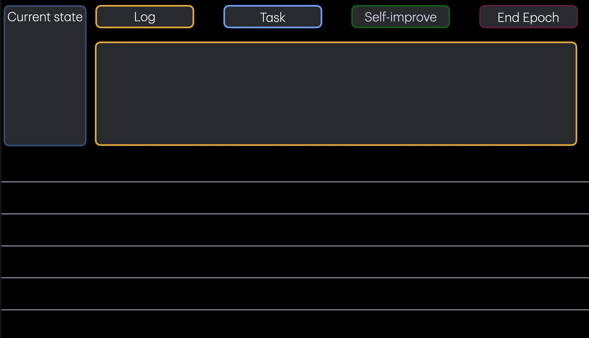

# SLS VSCode Extension -- Spec

Companion document to [SLS_PLANNING.md](SLS_PLANNING.md). Defines the user-facing extension that wraps the SLS framework in a purpose-built VSCode interface.



---

## Core Idea

A single VSCode Webview panel that replaces terminal-based Claude Code interaction for SLS projects. Two zones:

1. **Control Plane** (top) -- Skill buttons, current state indicator, and a chat interface that color-codes by active skill
2. **Archive Plane** (bottom) -- Pancake stack of archive entries, rich-collapsed, with epoch boundaries as dividers

The skill buttons (`Log`, `Task`, `Self-improve`, `End Epoch`) each start a new session pre-loaded with that skill's context. Clicking a button is equivalent to typing `/log`, `/task`, `/self-improve`, or `/update-and-archive` in a Claude Code terminal -- but with a visual identity (color, layout modifiers) that reflects the active skill.

---

## Structural Enforcement

The extension doesn't just display the SLS workflow -- it structurally enforces it. Several principles from [SLS_PLANNING.md](SLS_PLANNING.md) that depend on convention in the terminal become properties of the interface in the extension:

**Alignment through structure.** SLS's primary principle is that alignment is "actively constructed and maintained through every interaction." In the terminal, this depends on the agent reading CLAUDE.md and following skill protocols. The extension achieves it spatially: you cannot start interacting without first declaring intent via a skill button. The dialogue begins pre-aligned. The skill choice IS the alignment step.

**Loop visibility.** The fundamental cycle (Work -> Archive -> Analyze -> Improve) is described textually in the planning doc. In the extension, the four buttons encode it spatially: Task -> End Epoch -> Self-improve -> back to Task. A new user doesn't need to read the planning doc to discover the rhythm -- the UI is the rhythm.

**Single-agent as physical constraint.** One chat zone. One border color. One state indicator. You can't accidentally open a second terminal and start a conflicting session. The "One Working Agent at a Time" architectural invariant stops being a rule and becomes a property of the interface.

**Transparency becomes ambient.** The archive plane is always visible. Every entry stacks up in front of you. Epoch boundaries are visual dividers. You can't avoid seeing the accumulation of structured data. The "no hidden state" principle holds without any effort from the user.

**Introspection promoted to peer status.** Self-improve sits at the same visual level as Task. Not buried in documentation, not a slash command you have to remember exists. Reflection is a first-class activity, not an afterthought.

**Verification rendered.** Phase indicators (task phase bar, update-and-archive substates) make gate enforcement visible. In the terminal, gates are invisible until they block you. In the extension, you watch yourself move through alignment -> planning -> execution -> finalization. The structure of the work is rendered, not just the work itself.

**Data generation automatic.** Every interaction through the extension flows through a skill, producing structured archive data. In raw Claude Code, a user can just chat without invoking skills, producing no structured entries. The extension makes the unstructured path the exception rather than the default.

**Escape hatch preserves flexibility.** Users can always drop into raw Claude Code for unconstrained interaction. The extension provides structure for the common case without caging power users. This is the Flexibility principle ("configuration over convention") made literal: the UI is the configuration, the terminal is the convention.

The net effect: the extension transforms SLS from a discipline (follow these conventions, run these commands, maintain this rhythm) into an environment (the conventions are the interface, the rhythm is the layout, the discipline is structural).

### Orchestration Overhead Reduction

Specific overhead that disappears with the extension:

- **Skill enforcement:** No CLAUDE.md instructions needed to ensure users invoke skills. The UI only offers skill-shaped interaction.
- **Phase tracking:** No need for the agent to render phase state in text. The UI displays it natively via phase bars and substate indicators.
- **Orphan prevention:** No risk of sessions that bypass archival. Every interaction flows through a skill, which flows through the archive.
- **Question UX:** AskUserQuestion becomes a native UI card rather than a terminal interruption -- structured options render as buttons, not text.
- **State awareness:** The "Current State" widget eliminates the need to call `sls_skill_status()` manually. State is always visible.

---

## Layout

```
+---------------------------------------------+
| [Current State]  [Log] [Task] [SI] [End]    |
+---------------------------------------------+
|                                             |
|   Chat zone (border color = active skill)   |
|   - Messages render top-down                |
|   - Input box at bottom                     |
|   - Skill-specific chrome (phase indicator, |
|     todo progress, plan preview)            |
|                                             |
+---------------------------------------------+
|  > 2026-02-03 14:22  task  execution  #104  |
|  > 2026-02-03 12:01  build  T5:100 T6:91   |
|  > 2026-02-03 10:30  self-improve  P1-P4    |
|  =========== Epoch 7 ====================== |
|  > 2026-02-02 ...                           |
+---------------------------------------------+
```

### Control Plane Details

**Current State widget:** Small box showing `idle`, `task:execution`, `self-improve:discovery`, etc. Reads from `sls_skill_status()` or the archive state. Updates on every archive entry.

**Skill buttons:** Four buttons with fixed colors:
| Button | Color | Skill | Claude Code equivalent |
|--------|-------|-------|-----------------------|
| Log | Green | `/log` | Quick issue capture |
| Task | Blue | `/task` | Structured task execution |
| Self-improve | Gold | `/self-improve` | Recursive self-improvement |
| End Epoch | Red | `/update-and-archive` | Epoch close |

Clicking a button:
1. Changes the chat zone border to match the button color
2. Starts a new Claude Code session with the skill's prompt pre-loaded
3. Streams output into the chat zone

**Chat zone:** The primary interaction surface. Functions like a Claude Code text box. Small modifiers per skill:
- **Task:** Phase indicator bar (alignment / planning / execution / finalization)
- **Self-improve:** Pillar progress (which pillars have findings)
- **Log:** Minimal -- just the input and confirmation
- **End Epoch:** Progress through substates (retrospective / readme / oracle / porcelain / upload)

### Archive Plane Details

**Rich collapsed rows:** Each row shows:
- Timestamp
- Trigger icon (build / skill / manual)
- Skill name + substate (if skill-triggered)
- Tags (compact badges)
- Quality score badges (T5, T6, etc.)

**Expand:** Click to reveal full notes, retrospective summary, epoch summary data.

**Epoch dividers:** Visual separators between epochs. Show epoch number and aggregate stats (entry count, date range).

---

## Architecture

### Connection to Claude

The extension must preserve:
- CLAUDE.md integration (project instructions)
- Local permission model (hook restrictions, sandbox)
- Free usage tier (no API billing)

This means the backend **must** be Claude Code, not the Anthropic API directly.

#### Option 1: Claude Code CLI (viable today)

```
Extension                    Claude Code CLI
   |                              |
   |-- spawn process ------------>|
   |   claude --print             |
   |   --session-id <id>          |
   |   --allowedTools [...]       |
   |                              |
   |<-- JSONL stream -------------|
   |   (messages, tool calls,     |
   |    tool results, todos)      |
   |                              |
   |-- stdin (user input) ------->|
   |                              |
```

- Shell to `claude` CLI with `--print` for structured JSONL output
- Parse the stream, render messages in the webview
- Pipe user input from the chat box to stdin
- Skill buttons compose the initial prompt (e.g., `/task #42`)

**Pros:** Works today. Preserves all Claude Code behavior.
**Cons:** Parsing JSONL output is fragile. AskUserQuestion interactions need custom rendering. No official contract on output format stability.

#### Option 2: Claude Code Extension API (ideal, not yet available)

```
Extension                    Claude Code Extension
   |                              |
   |-- vscode.commands ---------> |
   |   claude.startSession({      |
   |     prompt: "/task #42",     |
   |     onMessage: callback      |
   |   })                         |
   |                              |
   |<-- structured callbacks -----|
   |   onMessage, onQuestion,     |
   |   onTodoUpdate, onComplete   |
   |                              |
```

- Extension-to-extension communication via VSCode command palette
- Structured callbacks for messages, questions, todos, completion
- Full control over rendering without parsing raw output

**Pros:** Clean API, stable contract, proper event model.
**Cons:** Does not exist. Would require Anthropic to expose a programmatic interface from the Claude Code VSCode extension.

#### Option 3: Agent SDK (fallback)

- Full control but loses CLAUDE.md, permissions, and free tier
- Only viable if the extension reimplements CLAUDE.md loading and tool permission
- Not recommended unless Options 1/2 are blocked

### Recommended Path

**Ship with Option 1**, design the internal API as if Option 2 exists (clean message/event abstractions). When Claude Code exposes an extension API, swap the backend without touching the UI layer.

```
┌─────────────────────┐
│   Webview UI Layer   │  React or vanilla -- renders messages, buttons, archive
├─────────────────────┤
│   Session Abstraction│  startSession(), sendInput(), onMessage(), onComplete()
├─────────────────────┤
│   CLI Backend        │  Spawns claude process, parses JSONL, emits events
│   (swap to ext API)  │
└─────────────────────┘
```

---

## Data Flow

### Read Path (no Claude Code dependency)

The archive plane is purely read-only and needs no Claude Code connection:

```
Extension --> MCP Server --> Archive files (JSON)
          |
          +--> sls_archive_state()
          +--> sls_search_entries()
          +--> sls_epoch_summary()
          +--> sls_skill_status()
```

The extension can call MCP tools directly (they're just Python functions) or read the archive index JSON file at `dev/storage/archive/index.json`.

### Write Path (requires Claude Code)

All mutations flow through Claude Code sessions:
- Skill start/transition/end
- File edits
- Git operations
- Archive uploads

The extension never writes directly -- it starts a Claude Code session and lets the agent handle state management.

---

## Skill-Specific UI Modifiers

Each skill gets small layout additions in the chat zone. These are progressive enhancements, not separate views.

### `/task`
- **Phase bar:** Five-segment indicator (alignment / planning / execution / finalization / archive)
- **Issue badge:** If started with `#N`, show issue title and link
- **Todo list:** Mirror the TodoWrite state as a sidebar checklist

### `/self-improve`
- **Pillar badges:** Four indicators for each analysis pillar, lighting up as findings are produced
- **Finding cards:** Collapsible cards for each finding with severity/confidence

### `/log`
- **Minimal:** Just the input and a confirmation card with the created issue link

### `/update-and-archive`
- **Substate progress:** Five-step indicator (retrospective / readme / oracle / porcelain / upload)
- **Repo status grid:** Small grid showing porcelain state per repo (clean/dirty/ahead)

---

## Extension Structure

```
sls-vscode/
  package.json          # Extension manifest, contributes webview
  src/
    extension.ts        # Activation, webview provider registration
    backend/
      session.ts        # Session abstraction (start, input, events)
      cli-backend.ts    # Claude Code CLI implementation
      types.ts          # Message, ToolCall, Question, Todo types
    ui/
      index.html        # Webview entry point
      app.ts            # Main UI controller
      components/
        control-bar.ts  # Skill buttons + state indicator
        chat-zone.ts    # Message rendering + input
        archive-list.ts # Pancake stack of entries
        skill-chrome/   # Per-skill UI modifiers
          task.ts
          self-improve.ts
          log.ts
          update-archive.ts
    data/
      archive-reader.ts # Read archive index/entries directly
      mcp-client.ts     # Call MCP tools for live state
```

---

## Relationship to SLS

This extension IS the SLS user interface for VSCode users. The SLS framework (archive, skills, MCP, CLI) provides the backend; this extension provides the frontend.

```
SLS Framework          SLS Extension
  Archive     <------>   Archive Plane (read)
  Skills      <------>   Skill Buttons (trigger)
  MCP Server  <------>   State Queries (poll)
  CLI         <------>   (fallback for non-VSCode)
  Claude Code <------>   Chat Zone (sessions)
```

Non-VSCode users interact through the terminal + CLI. VSCode users get the same capabilities with a richer interface. The framework is UI-agnostic; the extension is one possible frontend.

The extension also resolves several open questions from [SLS_PLANNING.md](SLS_PLANNING.md): package distribution (extension for IDE users, CLI for terminal users), MCP packaging (bundled as sidecar with the extension), and onboarding (extension activation replaces guided walkthrough). More fundamentally, it changes the framework's relationship to its own principles -- they stop being things to document and remember and start being things the interface enforces structurally.

---

## Compliance

### Anthropic (Claude Code)

In January 2026, Anthropic blocked third-party tools that spoofed Claude Code's client identity to use subscription OAuth tokens at favorable rates. The SLS extension does NOT do this.

The extension spawns the actual `claude` CLI binary as a child process -- functionally identical to running `claude` in any terminal emulator (iTerm, Warp, Hyper). It does not:
- Spoof client identity or headers
- Extract or reuse OAuth tokens
- Make direct API calls with subscription credentials
- Build a competing product or service

The extension is a rendering layer on top of Claude Code's own JSONL output. All model access flows through the official Claude Code binary running in its standard managed environment.

**Risk:** If Anthropic restricts programmatic CLI spawning (unlikely -- it would break CI/CD), the CLI backend breaks. The Option 2 extension API would be the clean resolution.

**Recommendation:** If distributing commercially, verify with Anthropic directly.

### VSCode Marketplace

Wrapping CLI tools in a webview is a standard extension pattern (GitLens wraps git, Docker extension wraps docker CLI). No marketplace restrictions apply.

---

## Self-Improvement Agent

The `sbs-self-improve` agent runs autonomously after every `/task` session. It is NOT triggered by a UI button — it runs automatically via the orchestrator.

### VSCode Extension Integration

The extension should observe task completion events and auto-trigger the self-improve agent. This is a background operation:
- No UI indicator needed (silent background work)
- No user interaction
- Failures are logged but never surface to the user
- Findings appear as GitHub issues automatically

### Hierarchy

Geometric 4x decay: L0 (every session) -> L1 (every 4) -> L2 (every 16) -> L(N) (every 4^N).

---

## Open Questions

1. **MCP tool access from extension:** Call Python MCP tools directly via child process, or run MCP server as a sidecar and use JSON-RPC?
2. **Session persistence:** When VSCode restarts, should the archive plane restore immediately (yes, from files) and should incomplete sessions resume (depends on Claude Code session persistence)?
3. **Multi-workspace:** One extension instance per VSCode window, each with its own SLS project? Or a single instance managing multiple projects?
4. **Notification model:** Should archive entries from background builds (e.g., CI) trigger VSCode notifications? Desktop notifications for epoch completion?
5. **Claude Code output contract:** The JSONL format from `claude --print` is undocumented. Need to audit current output format and determine how stable it is. Alternatively, monitor the Claude Code extension's planned API roadmap.
